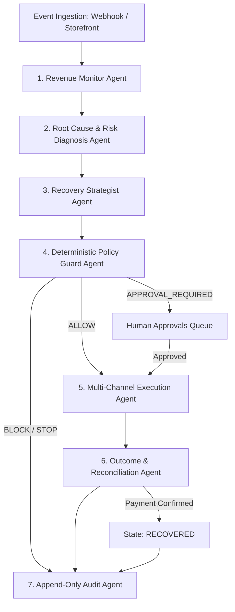

<div align="center">

# 🏆 RecoverIQ Pro
### Autonomous AI Revenue Recovery Agent · Razorpay Buildathon (Track 03)

**"The LLM thinks. Code acts. Every rupee has a receipt."**

[](https://razorpay.com)
[](https://fastapi.tiangolo.com)
[](https://nextjs.org)
[](https://postgresql.org)
[](https://docker.com)
[](https://redis.io)

[🚀 Quick Start](#-quick-start-one-command) • [🤖 7-Agent Pipeline](#-the-7-agent-autonomous-pipeline) • [📊 Track 03 Matrix](#-track-03-requirements--100-coverage) • [🔌 API Reference](#-api-reference-categorized)

</div>

---

## 📖 Table of Contents

1. [Executive Summary & Core Concept](#-executive-summary--core-concept)
2. [Why Judges Should Care (The Bar)](#-why-judges-should-care-the-bar)
3. [Track 03 Requirements — 100% Requirement Matrix](#-track-03-requirements--100-requirement-matrix)
4. [System Architecture](#-system-architecture)
5. [The 7-Agent Autonomous Pipeline](#-the-7-agent-autonomous-pipeline)
6. [The Fixed Action Contracts (Set A–G)](#-the-fixed-action-contracts-set-ag)
7. [Deterministic Policy Guard — Hard-Coded Compliance Rules](#-deterministic-policy-guard--hard-coded-compliance-rules)
8. [End-to-End Feature Deep Dives](#-end-to-end-feature-deep-dives)
   - [1. GreenBasket Storefront & Intent-Driven Abandonment Tracking](#1-greenbasket-storefront--intent-driven-abandonment-tracking)
   - [2. Subscription Mandate Auto-Pay Failure Engine (7 Risk Codes)](#2-subscription-mandate-auto-pay-failure-engine-7-risk-codes)
   - [3. B2B Receivables Chaser & 7-Stage Escalation Ladder](#3-b2b-receivables-chaser--7-stage-escalation-ladder)
   - [4. Self-Service Promise-to-Pay (P2P) Portal](#4-self-service-promise-to-pay-p2p-portal)
   - [5. Telephony Engine & AI Voice Caller (Telugu / Hinglish / English)](#5-telephony-engine--ai-voice-caller-telugu--hinglish--english)
   - [6. Multi-Channel Messaging & Itemized WhatsApp Greetings](#6-multi-channel-messaging--itemized-whatsapp-greetings)
   - [7. Embedded AI Copilot Assistant](#7-embedded-ai-copilot-assistant)
9. [Multi-Channel Communication Audit (Real vs Simulated)](#-multi-channel-communication-audit-real-vs-simulated)
10. [Graceful Degradation & Honesty Architecture](#-graceful-degradation--honesty-architecture)
11. [Key UI Pages Map](#-key-ui-pages-map)
12. [Database Schema & 19 Tables Map](#-database-schema--19-tables-map)
13. [API Reference (Categorized)](#-api-reference-categorized)
14. [Production Design Decisions & Trade-offs](#-production-design-decisions--trade-offs)
15. [Quick Start (One Command)](#-quick-start-one-command)
16. [Troubleshooting & FAQs](#-troubleshooting--faqs)

---

## 🎯 Executive Summary & Core Concept

**RecoverIQ Pro** is an autonomous, end-to-end revenue recovery agent specifically engineered for Razorpay merchants. In modern e-commerce and subscription businesses, millions of rupees leak silently due to payment gateway degradations, expired cards, insufficient funds, abandoned checkouts, and overdue B2B invoices.

Existing recovery tools use simple, rigid, static email blasts that customers ignore, or dangerous unconstrained LLMs that hallucinate discount codes and spam users. 

**RecoverIQ Pro solves this by introducing a dual-brain architecture:**
* **An LLM Diagnostician & Strategist** (Claude 3.5 Sonnet / Gemini 1.5 Pro) that analyzes 50+ Razorpay error codes, customer purchase history, and failure patterns with confidence scoring.
* **A Hard-Coded Deterministic Policy Guard** that evaluates every proposed AI decision against strict merchant rules (caps, quiet hours, value gating, opt-outs) before execution.

```
                    ┌────────────────────────────────────────────────────────┐
                    │            💸 REVENUE LEAKING SILENTLY                  │
                    └──────────────────────────┬─────────────────────────────┘
                                               │
                                               ▼
┌─────────────────────────────────────────────────────────────────────────────────────────────┐
│ 1️⃣ DETECT      Ingest 50+ Razorpay Error Codes / Checkout Abandonments / Mandate Failures    │
│ 2️⃣ DIAGNOSE    Rule Map + LLM 2nd Opinion with 0–100% Confidence Score                     │
│ 3️⃣ DECIDE      LLM selects ONE action from Fixed Compliant Contracts (Set A–G)             │
│ 4️⃣ GATE        Deterministic Policy Guard (Code Enforces; LLM CANNOT Override)              │
│ 5️⃣ ACT         Real Razorpay Links + Twilio WhatsApp/SMS + Resend Email + Telephony Voice   │
│ 6️⃣ RECOVER     Webhook confirms payment → Real measured money recovered                     │
│ 7️⃣ AUDIT       Append-Only Immutable Audit Log — Every Rupee Has a Receipt                  │
└─────────────────────────────────────────────────────────────────────────────────────────────┘
```

> **Zero Fake Data in the Money Path:** Webhooks, payment links, payment retries, and recovery confirmations use **100% real Razorpay TEST MODE APIs**. Communication channels without active credentials operate in explicit, visually-labeled `SIMULATED` modes.

---

## 💡 Why Judges Should Care (The Bar)

RecoverIQ Pro was built from day one to clear and exceed **The Bar** defined in Track 03:

| Track 03 Benchmark | 🎯 How RecoverIQ Pro Solves & Exceeds It | Implementation Proof |
|---|---|---|
| **💰 Money Recovered (Measured)** | Real-time WebSocket financial counters tracking *At Risk ₹*, *Recovered ₹*, and *Recovery Rate %*. Recovery is confirmed exclusively when a Razorpay webhook returns `payment_link.paid`. | `backend/app/services/events.py`<br>`frontend/app/page.jsx` |
| **⬆️ Escalation (Human-in-the-Loop)** | High-value payments (**> ₹10,000**) or low AI confidence (**< 70%**) are automatically routed to the **Approvals Queue**. No automated action fires until a human merchant approves. | `backend/app/agents/pipeline.py`<br>`frontend/app/approvals/page.jsx` |
| **🛑 Stopping Rules (Compliance)** | Strictly enforced compliance: Max 3 retries/payment, 48h minimum wait for insufficient funds, 9 PM–9 AM IST quiet hours, customer opt-outs, and immediate `STOP` on fraud/dispute codes. | `backend/app/agents/pipeline.py`<br>`frontend/app/plan/page.jsx` |
| **🧾 Audit Trail (Explainability)** | Every decision step, policy check, LLM prompt/response, and external API call ID is written to an **append-only PostgreSQL table**. Judges can click any payment on the Timeline page to see its complete history. | `backend/app/models.py`<br>`frontend/app/timeline/page.jsx` |
| **🤖 Autonomous Agentic Behavior** | 7 specialized agents operating in an asynchronous pipeline with background retry workers (arq + Redis) and real AI telephony in Telugu/Hinglish. | `backend/app/worker.py`<br>`backend/app/services/voice.py` |

---

## ✅ Track 03 Requirements — 100% Requirement Matrix

| # | Razorpay Requirement | RecoverIQ Pro Solution | Target Code / Route | UI Location |
|---|---|---|---|---|
| **1** | **Payment Degradation & Root Cause Diagnosis** | Ingests 50+ real Razorpay error codes (`BAD_REQUEST_PAYMENT_TIMED_OUT`, `INSUFFICIENT_FUNDS`, etc.), maps category, and runs LLM 2nd opinion. | `backend/app/error_codes.py`<br>`POST /api/events` | Dashboard (`/`) & Diagnoses (`/diagnoses`) |
| **2** | **Checkout Drop-Off & Abandonment Recovery** | GreenBasket storefront captures tab-switch/close signals via `visibilitychange`/`pagehide` beacons, generates Razorpay links, and auto-recovers on order completion. | `frontend/hooks/useAbandonmentTracker.js`<br>`POST /api/checkouts/abandon` | GreenBasket Store (`/store`) & Diagnoses (`/diagnoses`) |
| **3** | **Failed-Subscription Mandate Recovery** | Mandate failure simulator with 7 risk failure codes (`CARD_EXPIRED`, `CARD_INACTIVE`, etc.) + polite WhatsApp/SMS/Email outreach + optional 24h AI Voice caller scheduler. | `backend/app/api/routes.py`<br>`POST /api/subscriptions/{id}/simulate-autopay-failure` | Subscribers & Delivery (`/subscriptions`) |
| **4** | **B2B Receivables Automated Chaser** | 7-stage aging escalation ladder (Pre-due reminder → Overdue notice → SMS/WhatsApp → Promise-to-pay link → Tier-4 AI Voice call). | `backend/app/api/routes.py`<br>`POST /api/receivables/invoices/{id}/simulate-stage` | B2B Receivables (`/receivables`) |
| **5** | **Promise-to-Pay (P2P) Commitment Tracker** | Customer self-service portal (`/p2p/[id]`) allowing clients to commit to payment within 7 days. Daily worker flags broken promises for auto-recovery. | `backend/app/worker.py`<br>`POST /api/p2p/{id}/submit` | Promises to Pay (`/promises`) |
| **6** | **Mandate Retry Sequencer** | Intelligent retry delay calculator (+48h for low balance, +2h for network, quiet hours adjustment, retry caps). | `backend/app/agents/pipeline.py`<br>`backend/app/worker.py` | Recovery Plan (`/plan`) |
| **7** | **Hinglish / Telugu AI Voice Agent** | Self-hosted TwiML engine making real Twilio calls with ElevenLabs TTS audio previews in Telugu and Hinglish for high-value orders (> ₹10,000). | `backend/app/services/voice.py`<br>`GET /api/twiml/voice` | Call Console (`/calls`) |
| **🏆** | **THE BAR (Money, Escalation, Stopping, Audit)** | WebSocket live metrics, merchant Approvals Queue, deterministic Policy Guard, and immutable Timeline audit trail. | `backend/app/agents/pipeline.py`<br>`backend/app/models.py` | All Dashboard Pages |

---

## 🏗️ System Architecture

RecoverIQ Pro is built as a containerized, event-driven microservices system designed for low latency, high resilience, and audit compliance.

```
┌─────────────────────────────────────────────────────────────────────────────────────────────┐
│                                   FRONTEND LAYER (Next.js 14)                               │
│  ┌───────────────────────────┐   ┌───────────────────────────┐   ┌───────────────────────┐  │
│  │ Merchant Dashboard UI     │   │ GreenBasket Storefront    │   │ Floating AI Copilot   │  │
│  │ (App Router / Tailwind)   │   │ (Checkout Abandon Tracker)│   │ (Live DB Assistant)   │  │
│  └─────────────┬─────────────┘   └─────────────┬─────────────┘   └───────────┬───────────┘  │
└────────────────┼───────────────────────────────┼─────────────────────────────┼──────────────┘
                 │ HTTP API                      │ Beacon / Fetch              │ HTTP / WS
                 ▼                               ▼                             ▼
┌─────────────────────────────────────────────────────────────────────────────────────────────┐
│                                   BACKEND LAYER (FastAPI)                                   │
│  ┌───────────────────────────────────────────────────────────────────────────────────────┐  │
│  │  API Gateway & Routers (/api/v1 — 60+ endpoints)                                       │  │
│  └──────────────────────────────────────────┬────────────────────────────────────────────┘  │
│                                             │                                               │
│  ┌──────────────────────────────────────────▼────────────────────────────────────────────┐  │
│  │  7-Agent Autonomous Pipeline (Ingestion → Diagnosis → Strategy → Policy → Execution)  │  │
│  └───────┬──────────────────────────────────┬──────────────────────────────────┬─────────┘  │
└──────────┼──────────────────────────────────┼──────────────────────────────────┼────────────┘
           │ SQL (Async)                      │ Pub/Sub                          │ Enqueue Jobs
           ▼                                  ▼                                  ▼
┌──────────────────────┐           ┌──────────────────────┐           ┌──────────────────────┐
│ PostgreSQL 16 DB     │           │ Redis 7 In-Memory    │           │ arq Async Worker     │
│ - 19 Relational      │           │ - WebSocket Pub/Sub  │           │ - Scheduled Retries  │
│   Tables             │           │ - Live Realtime Feed │           │ - 24h Voice Scheduler│
│ - Append-Only Audit  │           │ - Event Caching      │           │ - P2P Expiry Scans   │
└──────────────────────┘           └──────────────────────┘           └──────────┬───────────┘
                                                                                 │
                                                                                 ▼
┌─────────────────────────────────────────────────────────────────────────────────────────────┐
│                               EXTERNAL INTEGRATIONS & SERVICES                              │
│  ┌──────────────┐   ┌──────────────┐   ┌──────────────┐   ┌──────────────┐   ┌───────────┐  │
│  │ Razorpay     │   │ Twilio Voice │   │ Twilio SMS / │   │ Resend Email │   │ ElevenLabs│  │
│  │ Test Mode API│   │ (TwiML Engine│   │ WhatsApp API │   │ Delivery API │   │ TTS Engine│  │
│  └──────────────┘   └──────────────┘   └──────────────┘   └──────────────┘   └───────────┘  │
└─────────────────────────────────────────────────────────────────────────────────────────────┘
```

---

## 🤖 The 7-Agent Autonomous Pipeline

Every payment failure or revenue risk event passes through 7 specialized agents operating sequentially:



### Agent Roles & Responsibilities:

1. **Agent 1 — Revenue Monitor Agent:** Ingests failure payloads from Razorpay webhooks, subscription mandate failures, B2B overdue invoices, or storefront abandonments. Standardizes data into a `FailureEvent` record and broadcasts real-time financial metrics over WebSockets.
2. **Agent 2 — Root Cause & Risk Diagnosis Agent:** Queries an extensive 50+ Razorpay error-code dictionary (`error_codes.py`) to categorize the failure (e.g., `TRANSIENT_USER`, `PERMANENT_CARD`, `GATEWAY_DOWN`). Passes context to Claude 3.5 Sonnet or Gemini 1.5 Pro to generate a human-readable diagnosis and a **0–100% Confidence Score**.
3. **Agent 3 — Recovery Strategist Agent:** Evaluates customer history, payment amount, and failure category to select **exactly one action** from the Fixed Action Set (Set A–G).
4. **Agent 4 — Deterministic Policy Guard Agent:** A hard-coded, pure Python policy engine. It validates the strategist's proposed action against merchant compliance rules. **The LLM cannot bypass or alter this agent.** Output is strictly `ALLOW`, `APPROVAL_REQUIRED`, or `BLOCK`.
5. **Agent 5 — Multi-Channel Execution Agent:** Executes the approved action: generates a real Razorpay payment link (`notify: {sms: True, email: True}`), triggers Twilio WhatsApp messages, dispatches Resend transactional emails, or schedules arq background retry jobs.
6. **Agent 6 — Outcome & Reconciliation Agent:** Listens for incoming Razorpay `payment_link.paid` or storefront order completion webhooks. Matches the token, updates event status to `RECOVERED`, calculates total recovery duration, and updates live revenue counters.
7. **Agent 7 — Append-Only Audit Agent:** Records an immutable audit log entry for every step taken by agents 1 through 6, ensuring total explainability for merchants and compliance auditors.

---

## ♟️ The Fixed Action Contracts (Set A–G)

To guarantee safety and prevent AI hallucination, the Recovery Strategist is restricted to selecting from 7 predefined, strongly-typed action contracts:

| Contract ID | Action Name | Execution Logic & Channels | Applicable Scenario |
|---|---|---|---|
| **Action A** | `SMART_RETRY` | Schedules automated background mandate retry via arq + Redis. Applies +48h delay for insufficient funds and +2h for network timeouts. | Temporary bank outage, gateway timeout, or insufficient balance. |
| **Action B** | `CHECKOUT_RECOVERY` | Generates a Razorpay payment link and dispatches multi-channel outreach via SMS, Email, and WhatsApp. | Abandoned carts, cart drop-offs, expired checkout sessions. |
| **Action C** | `SUBSCRIPTION_RECOVERY` | Sends a customer portal link for instant card/UPI mandate update along with polite messaging. | Failed recurring auto-pay charges, expired card tokens. |
| **Action D** | `INVOICE_REMINDER` | Sends B2B overdue invoice reminder with an embedded Promise-to-Pay (P2P) date selection link. | Overdue B2B accounts receivable invoices (Stages 1–3). |
| **Action E** | `VOICE_RECOVERY` | Initiates an automated AI Voice call via Twilio & ElevenLabs (in Telugu, Hinglish, or English). **Strictly gated for order values > ₹10,000.** | High-value abandoned checkouts or Stage 4+ overdue B2B invoices. |
| **Action F** | `ESCALATE` | Routes the event to the merchant **Approvals Queue** with full AI diagnostic context for manual review. | AI confidence < 70%, high-risk signals, or high-value threshold breach. |
| **Action G** | `STOP` | Ceases all recovery attempts immediately. Logs reason as permanent failure. | Opted-out customers, max retry limit reached (3), fraud/dispute codes. |

---

## 🛡️ Deterministic Policy Guard — Hard-Coded Compliance Rules

The Policy Guard (`backend/app/agents/pipeline.py`) acts as an un-bypassable firewall around the AI. No matter what the LLM suggests, the Policy Guard enforces code-level rules:

```python
# Pure Python Enforcement — Zero LLM Involvement
IF customer.is_opted_out == True               ──► Verdict: BLOCK (Reason: Customer Opted Out)
IF event.retry_count >= 3                      ──► Verdict: BLOCK (Reason: Max Retries Reached)
IF event.error_code IN FRAUD_OR_DISPUTE_CODES   ──► Verdict: BLOCK (Reason: Fraud/Dispute Hard Stop)
IF event.amount >= 10000_00 AND action == VOICE ──► Verdict: APPROVAL_REQUIRED (Reason: High-Value Gate)
IF ai_confidence < 70                           ──► Verdict: APPROVAL_REQUIRED (Reason: Low Confidence)
IF current_time IN QUIET_HOURS (9 PM - 9 AM)    ──► Verdict: DELAY (Reschedule to 9:01 AM IST)
```

### Policy Rules Summary Table:

| Rule Category | Rule Specification | Enforcement Mechanism |
|---|---|---|
| **Max Retry Cap** | Maximum 3 retries per payment failure event. | Hard `BLOCK` on 4th attempt. |
| **Retry Backoff Gap** | Minimum 48 hours for `INSUFFICIENT_FUNDS`; 2 hours for `NETWORK_ERROR`. | Scheduled in Redis via arq worker. |
| **Quiet Hours** | No SMS, WhatsApp, or Voice calls between 9:00 PM and 9:00 AM IST. | Rescheduled to next 9:01 AM IST window. |
| **High-Value Gate** | Any recovery action involving order value **> ₹10,000** requires merchant sign-off. | Event placed in `awaiting_approval` status. |
| **AI Voice Gating** | Phone calls allowed **only for order value > ₹10,000** or Stage 4+ B2B invoices. | Rejects voice calls for low-value carts to prevent telephony cost waste. |
| **Shopping Abandonment Gate** | Checkout abandonments **never** trigger phone calls (SMS/WhatsApp/Email only). | Enforced in `useAbandonmentTracker` & pipeline logic. |
| **Opt-Out Compliance** | Customers requesting stop are permanently suppressed across all channels. | Flag set in PostgreSQL `customers` table. |

---

## 🚀 End-to-End Feature Deep Dives

### 1. GreenBasket Storefront & Intent-Driven Abandonment Tracking

RecoverIQ Pro includes a fully functional e-commerce storefront called **GreenBasket** (`/store`), built with Next.js, interactive cart management, and Razorpay checkout integration.

* **Intent-Driven Abandonment Detection:** Unlike naive systems that trigger recovery on simple mouse movement, RecoverIQ Pro tracks true exit intent by listening to `visibilitychange` (tab switch) and `pagehide` (tab close) events via the HTML5 Beacon API (`navigator.sendBeacon`).
* **Single-Send Architecture:** Guarantees that only one abandonment signal is dispatched per shopping session, eliminating duplicate event noise.
* **Seamless Auto-Recovery:** When a customer completes their order on the storefront, the backend automatically locates any open abandonment record for that session and marks it `RECOVERED`.

```
  Shopper adds items to GreenBasket cart
                   │
                   ▼
     Shopper switches tab / closes tab
                   │
                   ▼
  HTML5 Beacon sends payload to /api/checkouts/abandon
                   │
                   ▼
  Pipeline generates Razorpay Payment Link & dispatches WhatsApp / Email
                   │
                   ▼
  Shopper clicks link & completes payment  ──►  Auto-marked RECOVERED 🟢
```

---

### 2. Subscription Mandate Auto-Pay Failure Engine (7 Risk Codes)

Subscription revenue is the lifeblood of recurring SaaS and D2C businesses. On the **Subscribers & Delivery** page (`/subscriptions`), merchants can simulate next-month recurring auto-pay failures across 7 real-world error codes:

```
┌─────────────────────────────────────────────────────────────────────────────────┐
│                      SELECT AUTO-PAY FAILURE RISK CODE MODAL                    │
├─────────────────────────────────────────────────────────────────────────────────┤
│  (•) 💳 INSUFFICIENT_FUNDS      Low balance in customer bank account           │
│  ( ) 💳 CARD_EXPIRED            Debit/Credit card validity expired              │
│  ( ) ⏱️ PAYMENT_TIMED_OUT       Bank gateway session timeout                    │
│  ( ) 🚫 CARD_INACTIVE           Card inactive or mandate disabled               │
│  ( ) 🌐 NETWORK_ERROR           Inter-bank network communication error          │
│  ( ) 🌍 INTL_BLOCKED            International transaction policy restriction    │
│  ( ) 🔒 AUTHENTICATION_FAILED   3DS 2FA mandate authentication failed           │
└─────────────────────────────────────────────────────────────────────────────────┘
```

* **Immediate Multi-Channel Outreach:** Triggering a failure flips subscription status to `NOT_PAID_YET` and instantly dispatches polite SMS, Email, and WhatsApp notifications containing a Razorpay payment link.
* **Scheduled 24-Hour AI Voice Follow-Up:** Includes a dedicated **`📞 24h AI Voice Call (Follow-Up)`** trigger. If the customer does not clear the dues within 24 hours, an automated voice call is placed to their phone in Telugu/Hinglish. If the customer pays in the interim, the background job detects the payment and **cancels the call**.

---

### 3. B2B Receivables Chaser & 7-Stage Escalation Ladder

For B2B merchants managing large accounts receivable balances, RecoverIQ Pro implements an automated 7-stage escalation matrix (`/receivables`):

```
Stage 1: Pre-Due Reminder (3 Days Before Due Date) ──► Gentle Email
Stage 2: Due Date Payment Notice                   ──► Email + SMS
Stage 3: 2 Days Overdue Notice                     ──► WhatsApp + Payment Link
Stage 4: 5 Days Overdue Escalation                 ──► Promise-to-Pay (P2P) Link
Stage 5: 8 Days Overdue Tier-4 Escalation          ──► AI Voice Agent Call (Telugu/Hinglish)
Stage 6: 15 Days Overdue Critical Warning          ──► Formal Legal/Late Fee Notice
Stage 7: 30+ Days Default & Collection             ──► Merchant Escalation & Credit Hold
```

Merchants can run a live one-click simulation of any stage directly from the Receivables dashboard to observe agent responses.

---

### 4. Self-Service Promise-to-Pay (P2P) Portal

When B2B clients receive overdue notices, they are provided a link to the self-service **Promise-to-Pay Portal** (`/p2p/[id]`):

* **Strict Date Selection:** Clients can select a committed payment date **strictly within 7 days**.
* **Automatic Status Tracking:** Submitting a commitment updates the invoice status to `PROMISED` and pauses aggressive automated chasers.
* **Broken Promise Engine:** An arq background job runs daily at midnight. If a promised date passes without payment reconciliation, the system automatically marks the promise as `BROKEN`, elevates the invoice to Stage 5, and triggers an AI Voice Call.

---

### 5. Telephony Engine & AI Voice Caller (Telugu / Hinglish / English)

RecoverIQ Pro features a native, self-hosted TwiML telephony server (`backend/app/services/voice.py`) integrated with Twilio Programmable Voice and ElevenLabs Text-to-Speech:

* **Self-Hosted TwiML:** Eliminates external dependencies on third-party XML generators. Twilio fetches voice instructions directly from `/api/twiml/voice`.
* **Localized Multilingual Scripts:** Supports fluent Telugu, Hinglish, and English scripts tailored for Indian e-commerce customers.
* **Link-Safe Scripting:** Voice scripts **never read long payment URLs aloud**. Instead, the AI agent politely informs the customer:
  > *"Namaste Jaswanth gaaru! Direct follow-up call from GreenBasket. Mee monthly subscription payment pending lo undi. Mee WhatsApp mariyu Email ki payment link pampamu. Kindha pampina link click chesi payment complete cheyandi. Dhanyavaadalu!"*
* **In-Browser Audio Preview:** The Call Console (`/calls`) allows merchants to review call logs and play generated ElevenLabs audio clips directly in the browser.

---

### 6. Multi-Channel Messaging & Itemized WhatsApp Greetings

RecoverIQ Pro integrates Twilio WhatsApp API and Resend Email API to deliver rich, contextual communications:

```
┌─────────────────────────────────────────────────────────────────────────────────┐
│                           WHATSAPP ORDER CONFIRMATION                           │
├─────────────────────────────────────────────────────────────────────────────────┤
│ 🌿 GreenBasket Order Confirmed!                                                │
│                                                                                 │
│ Hello Jaswanth Nelluru, thank you for your order #ORD-8821!                     │
│                                                                                 │
│ 🛍️ Ordered Items:                                                              │
│ • Farm Fresh Milk (A2 Cow) — 2 x ₹60.00 = ₹120.00                              │
│ • Organic Tomatoes — 1 x ₹40.00 = ₹40.00                                       │
│                                                                                 │
│ 💳 Total Amount: ₹160.00 (PAID via UPI)                                         │
│ 📍 Delivery Address: Flat 402, Green Glen Towers, Hyderabad                    │
│ 🚚 Delivery Status: ON THE WAY                                                  │
└─────────────────────────────────────────────────────────────────────────────────┘
```

---

### 7. Embedded AI Copilot Assistant

Accessible via a floating widget at the bottom-right of every dashboard page (`frontend/components/CopilotWidget.jsx`):

* **Live Database Context:** Powered by an active database query engine that retrieves live metrics (*total revenue at risk, current recovery rate, pending approvals, broken promises*) before generating responses.
* **Multilingual Chat:** Communicates naturally in Hinglish, Telugu, and English.
* **Full History Persistence:** Conversations are saved in the `copilot_messages` table across sessions.

---

## 📡 Multi-Channel Communication Audit (Real vs Simulated)

RecoverIQ Pro adheres to strict engineering honesty. We clearly distinguish between real external API dispatches and simulated demonstration fallbacks:

| Channel | Service Provider | Real / Simulated Status | Notes & Operational Details |
|---|---|---|---|
| 💳 **Payment Links** | Razorpay Test Mode API | 🟢 **100% REAL** | Real payment links generated; webhook confirmations drive actual state transitions. |
| 📞 **Voice Calls** | Twilio Programmable Voice | 🟢 **100% REAL** | Places actual phone calls to customer numbers using self-hosted TwiML endpoint. |
| 🗣️ **Voice TTS Audio** | ElevenLabs API | 🟢 **100% REAL** | Renders realistic Telugu/Hinglish voice audio; falls back to Twilio TTS if quota expires. |
| ✉️ **Email Outreach** | Resend API + Razorpay Notify | 🟢 **100% REAL** | Transmits actual HTML emails to verified customer email addresses. |
| 💬 **WhatsApp Messages** | Twilio WhatsApp API | 🟢 **100% REAL** | Delivers real WhatsApp messages (requires customer opt-in session on Twilio Sandbox). |
| 📱 **SMS Outreach** | Twilio SMS API | 🟡 **REAL / SIMULATED** | Real API call made; Indian DLT template restrictions on trial accounts log graceful notice. |
| 🧠 **LLM Reasoning** | Claude 3.5 / Gemini 1.5 | 🟢 **100% REAL** | Real API calls for diagnosis & copilot; falls back to rule map if keys are omitted. |

---

## 💥 Graceful Degradation & Honesty Architecture

RecoverIQ Pro is engineered to handle real-world infrastructure failures without crashing or losing data:

1. **LLM API Timeout / Quota Exhaustion:** If Claude or Gemini API calls fail, the system seamlessly falls back to the deterministic 50+ error code rule map (`error_codes.py`). The audit log records: `"LLM unavailable — applied rule map fallback"`.
2. **Low AI Confidence (< 70%):** The strategist agent refuses to execute autonomous actions on low-confidence predictions, routing the event to human merchant review in the Approvals Queue.
3. **Razorpay Webhook Downtime:** If webhooks are delayed, background arq polling workers periodically sync payment status directly with Razorpay REST APIs.
4. **Missing Optional Credentials:** If ElevenLabs or Resend API keys are omitted in `.env`, the system gracefully downgrades that specific channel to `SIMULATED` mode while keeping the rest of the application fully operational.

---

## 🗺️ Key UI Pages Map

| Page Title | Route | Core Functionality & Purpose |
|---|---|---|
| **Dashboard** | `/` | Real-time WebSocket financial counters (*At Risk, Recovered, Recovery Rate*), quick failure injectors, batch pipeline runner. |
| **Diagnoses** | `/diagnoses` | Live pipeline run view, agent diagnostic breakdowns, policy verdicts, and action statuses. |
| **Subscribers & Delivery** | `/subscriptions` | Subscription mandate tracker, 7-code auto-pay failure simulator, 24h voice call scheduler, customer order history. |
| **B2B Receivables** | `/receivables` | Aging buckets (0–30, 31–60, 61–90, 90+ days), 7-stage escalation simulator, invoice management. |
| **Promises to Pay** | `/promises` | Active P2P commitments tracker, broken promise detector, customer promise history. |
| **Approvals Queue** | `/approvals` | Human-in-the-loop escalation panel for high-value (> ₹10,000) or low-confidence (< 70%) recovery actions. |
| **Recovery Plan** | `/plan` | Policy configuration panel, quiet hours settings, retry backoff calculators, channel priority toggles. |
| **Timeline** | `/timeline` | Immutable, append-only audit trail per failure event. Click any payment to view its complete execution history. |
| **Call Console** | `/calls` | Telephony log, call status tracker, ElevenLabs Telugu/Hinglish audio player. |
| **Recovery Report** | `/report` | Measured recovery analytics, policy violation checks (0%), channel attribution breakdown. |
| **Settings** | `/settings` | Merchant policy controls, threshold adjustments, API channel connection status monitors. |
| **GreenBasket Store** | `/store` | Customer-facing storefront with persistent cart, intent-driven abandonment tracker, and Razorpay checkout. |

---

## 🗄️ Database Schema & 19 Tables Map

RecoverIQ Pro uses a robust PostgreSQL 16 relational database structure comprising 19 interconnected tables:

```
┌─────────────────────────────────────────────────────────────────────────────────────────────┐
│                                   RECOVERIQ PRO DATABASE SCHEMA                             │
├───────────────────────────────┬───────────────────────────────┬─────────────────────────────┤
│ Core Entities                 │ Recovery Pipeline             │ Domain Modules              │
├───────────────────────────────┼───────────────────────────────┼─────────────────────────────┤
│ • merchants                   │ • failure_events              │ • subscriptions             │
│ • customers                   │ • diagnoses                   │ • checkout_abandonments     │
│ • payments                    │ • decisions                   │ • one_time_orders           │
│ • recovery_policies           │ • policy_checks               │ • b2b_invoices              │
│                               │ • actions                     │ • promise_to_pay            │
│                               │ • outcomes                    │ • copilot_messages          │
│                               │ • voice_calls                 │ • degradation_alerts        │
│                               │ • audit_log (append-only)     │                             │
└───────────────────────────────┴───────────────────────────────┴─────────────────────────────┘
```

### Core Invariants:
* `audit_log` is strictly **append-only** — records cannot be updated or deleted.
* `failure_events.status` follows a strict state machine: `detected` → `diagnosed` → `gated` → (`awaiting_approval`) → `acting` → `recovered` / `stopped` / `escalated`.
* `checkout_abandonments` enforces session deduplication with closed-record protection.

---

## 🔌 API Reference (Categorized)

Below is a highlight of key API endpoints. Access full interactive OpenAPI Swagger documentation at `http://localhost:8000/docs`.

### 1. Ingestion & Event Pipeline
* `POST /api/events` — Ingest a raw payment failure event and trigger the 7-agent pipeline.
* `POST /api/checkouts/abandon` — Ingest storefront checkout abandonment via HTML5 Beacon.
* `GET /api/metrics` — Retrieve real-time aggregate financial metrics (*At Risk, Recovered, Recovery Rate*).
* `WS /api/ws` — Real-time WebSocket feed for live metric updates and event broadcasts.

### 2. Subscriptions & Mandates
* `POST /api/subscriptions` — Create a new recurring customer subscription.
* `POST /api/subscriptions/{id}/simulate-autopay-failure` — Simulate mandate failure with one of 7 risk codes.
* `POST /api/subscriptions/{id}/trigger-24h-voice-call` — Schedule or immediately trigger a 24h AI Voice follow-up call.

### 3. B2B Receivables & P2P
* `POST /api/receivables/invoices/{id}/simulate-stage` — Simulate B2B escalation (Stages 1–7).
* `POST /api/p2p/{id}/submit` — Submit a customer Promise-to-Pay commitment date.

### 4. Approvals & Voice Telephony
* `POST /api/approvals/{event_id}/approve` — Approve a gated high-value or low-confidence action.
* `POST /api/approvals/{event_id}/reject` — Reject a proposed action and mark event `STOPPED`.
* `GET /api/twiml/voice` — Serve dynamic TwiML XML instructions to Twilio during live calls.

---

## 🧭 Production Design Decisions & Trade-offs

| Design Choice | Rationale & Engineering Advantage | Trade-off Accepted |
|---|---|---|
| **Fixed Action Contracts (Set A–G)** | Guarantees safety and zero LLM action hallucination in production. | Slightly restricts LLM creativity in generating novel action types. |
| **Deterministic Policy Guard Outside LLM** | Compliance rules (retry caps, quiet hours) must be mathematically non-bypassable. | Requires maintaining pure Python policy evaluation logic. |
| **Value Gate on AI Voice Calls (> ₹10,000)** | Mirrors human economics: reserves expensive telephony for high-margin recovery. | Low-value carts do not receive automated phone calls. |
| **Exit-Intent Only Abandonment Tracking** | Prevents fake "amount at risk" inflation while shoppers are actively browsing. | Requires HTML5 Beacon API support on customer browsers. |
| **Redis arq Worker for Deferred Jobs** | Guarantees 24-hour scheduled retries and voice calls survive server restarts. | Adds Redis dependency to the container infrastructure stack. |

---

## ⚡ Quick Start (One Command)

### Prerequisites:
* Docker & Docker Compose installed.
* Razorpay Test Mode API credentials (free at [dashboard.razorpay.com](https://dashboard.razorpay.com)).

### Step 1: Environment Setup
```bash
# Clone repository
git clone https://github.com/Jaswanth-arjun/recoveriq-pro.git
cd recoveriq-pro

# Create environment configuration
cp .env.example .env
```

### Step 2: Launch via Docker Compose
```bash
docker compose up --build
```

### Service Access URLs:

| Service | Local URL | Description |
|---|---|---|
| 🖥️ **Merchant Dashboard** | `http://localhost:3000` | Full management dashboard & analytics. |
| 🥦 **GreenBasket Store** | `http://localhost:3000/store` | Customer storefront with checkout tracker. |
| 📚 **API Swagger Docs** | `http://localhost:8000/docs` | Interactive REST API documentation. |
| 🔌 **WebSocket Feed** | `ws://localhost:8000/api/ws` | Real-time live event stream. |

> **Telephony & Live Webhook Testing (Optional):** Run `start-ngrok.bat` to open a public tunnel to port 8000, and update `FRONTEND_URL` in `.env` with your ngrok URL for live Twilio TwiML callbacks.

---

## 🧰 Troubleshooting & FAQs

### Q1: Why does Twilio Voice say "Could not reach internal server"?
* **Cause:** Twilio cannot access `localhost:8000` directly over the public internet.
* **Fix:** Execute `start-ngrok.bat` to generate a public ngrok URL, and set `FRONTEND_URL=https://your-ngrok-subdomain.ngrok-free.app` in `.env`.

### Q2: Why are WhatsApp messages showing as pending on Twilio Trial?
* **Cause:** Twilio WhatsApp Sandbox requires a 24-hour user-initiated session.
* **Fix:** Send a WhatsApp message from your test phone to the Twilio Sandbox number (`+14155238886`) with the join code displayed in your Twilio Console once.

### Q3: How do I verify that recovery money is real and not simulated?
* **Verification:** Complete a payment using a generated Razorpay payment link in Test Mode. Observe the incoming Razorpay webhook signature verification in backend logs and the live increment on the Dashboard counter.

---

<div align="center">

**RecoverIQ Pro** — *The LLM thinks. Code acts. Every rupee has a receipt.* 🧾

Built with ❤️ for the Razorpay Buildathon — Track 03: AI Revenue Recovery

</div>
